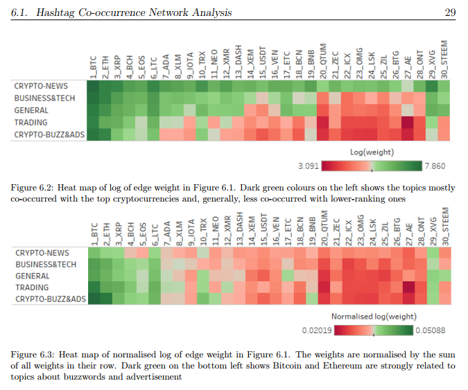

# Cryptocurrency Network Analysis on Twitter
This is Thanadon's Dissertation - Msc Data Science 2017-2018, University of Southampton

## Abstract

## Keywords used for tweet scraping

## Detected Community surrounded by cryptocurrencies

## Strength of relationship between cryptocurrencies and communities - This show "How likely that coin X will be mentioned in topic Y ?"

## Correlation Analysis of user preference over each cryptocurrency - This show "If users like a specific coin, which other coins they’re likely to like?"

## Homophily analysis - This show "If users like a specific coin, how likely their friends will also like it?"

## Conclusion

